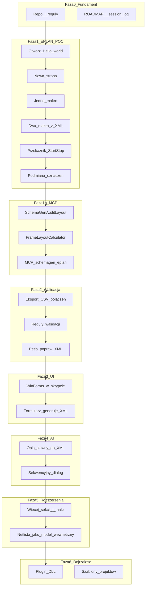

# SchemaGen — ścieżka rozwoju (techniczna)

Start bezpośrednio w EPLAN API (licencja + makra gotowe). Stara ścieżka „web app → netlista CSV” nie jest częścią tej roadmapy.

## Diagram faz

## Fazy

| Faza | Cel | Orientacyjny czas (45–60 min/dzień) |
|------|-----|--------------------------------------|
| **0** Fundament | Repo, reguły, dokumentacja, `config/` | 1 sesja |
| **1** EPLAN POC | Pełny `SchemaGen_MVP.cs` | 4–8 sesji |
| **2** Walidacja | Eksport CSV + reguły + pętla poprawek XML | 2–4 sesje |
| **3** UI | WinForms w skrypcie → generowanie XML | 2–3 sesje |
| **4** AI | Opis słowny → XML (Claude API) | 3–5 sesji |
| **5** Rozszerzenia | 24V, PLC, kolejne sekcje napędowe | ciągły, modułowo |
| **6** Dojrzałość | Plugin DLL, szablony projektów | po udanym POC w firmie |

---

## Faza 0 — Fundament

- [x] Struktura repozytorium (`docs/`, `config/`, `scripts/`)
- [x] Reguły Cursor (`.cursor/rules/eplan-schemagen.mdc`)
- [x] `docs/eplan-data-paths.txt`
- [x] `docs/ROADMAP.md` + `docs/session-log.md`
- [x] `config/901_Drive_Design.xml`

---

## Faza 1 — EPLAN POC

**MVP techniczny** (koniec Fazy 1): skrypt wczytuje `config/901_Drive_Design.xml`, generuje w `Hello_world.edb` schemat z:
- zasilaniem 400V (`400VAC_Power_Supply.ema`)
- falownikiem (`Frequency_Control.ema`)
- obwodem Start/Stop (przekaźnik podtrzymujący)
- podmienionymi tagami (np. `=MACHINE+CABINET-M1`)

**Poza zakresem Fazy 1:** safety, layout szafy, AI, WinForms.

### Sesje Fazy 1

| Sesja | Zakres | Wynik testu w EPLAN |
|-------|--------|------------------------|
| **1.1** ✅ | Otwórz `Hello_world.edb` | Komunikat sukcesu, projekt otwarty |
| **1.2** ✅ | Utwórz stronę schematu | Nowa strona widoczna w projekcie |
| **1.3** ✅ | Wstaw `400VAC_Power_Supply.ema` | Makro zasilania widoczne na stronie |
| **1.4** ✅ | Parsuj XML + wstaw `Frequency_Control.ema` | Dwie strony (400V + napęd), dane z XML, `generate CONNECTIONS` |
| **1.5** ✅ | Odnośniki potencjałów + Start/Stop + MacroFitCalculator | Pipeline OK; **layout w ramce: NIE** (makra poza ramką druku) |
| **1.6** ✅ | Połączenia silnika + tagi + FrameLayout + MCP fundament | Implementacja ✅ — test EPLAN + kalibracja Frame* |
| **1.7** | Test 1.6 + `eplan_closed_loop` + reguły walidacji CSV | Faza 2 start |

**Wzorzec kodu:** `PageNavi_ContextMenu_OpenFolders.cs` w folderze skryptów EPLAN.  
**Kod źródłowy:** `scripts/` → kopia do `C:\Users\Public\EPLAN\Data\Skrypty\Schemagen\`

---

## Faza 1b — MCP (zamknięty obieg z EPLAN)

**Cel:** agent (Cursor lub Claude Cowork) uruchamia EPLAN, dostaje wynik na bieżąco — bez ręcznego klikania przez użytkownika.

| Etap | Zakres | Priorytet |
|------|--------|-----------|
| **1b.1** | Akcja `SchemaGenAuditLayout` — bbox makra vs granice ramki strony (JSON) | Sesja 1.6 |
| **1b.2** | MCP `schemagen-eplan` — `eplan_build_addin`, `eplan_run_script`, `eplan_get_layout` | Sesja 1.6–1.7 |
| **1b.3** | `FrameLayoutCalculator` — auto-pozycjonowanie w ramce zamiast ręcznych stałych | Po 1b.2 |
| **1b.4** | Konfiguracja MCP w Cursor (`.cursor/mcp.json`) + Claude Cowork (`claude_desktop_config.json`) | Po 1b.2 |
| **1b.5** | EPLAN Remoting (gRPC) jako alternatywa dla CLI headless | Opcjonalnie |

**Claude Cowork:** plan 5-godzinny — autonomiczna praca nad repo gdy użytkownika nie ma przy PC (sesja 1.6+, naprawa layoutu, testy). Ten sam serwer MCP co Cursor.

---

## Tech debt

| ID | Temat | Stan (sesja 1.5) | Docelowe rozwiązanie | Kiedy refaktor |
|----|-------|------------------|----------------------|----------------|
| TD-01 | **Moduły skryptu w jednym pliku** | `SchemaGenConfig` (parser XML) jest w `SchemaGen_MVP.cs` — workaround na błąd EPLAN S046013 (osobny `.cs` w `Skrypty\` bez `[Start]`) | **Opcja A:** logika wspólna w add-in DLL (`SchemaGenLoadConfig` + cienka orkiestracja w MVP). **Opcja B:** `scripts/lib/*.cs` + `build_script.ps1` sklejający jeden plik przy deployu do EPLAN | Gdy pojawi się 3.–4. moduł (walidacja XML, mapowanie makr, tagi — sesje 1.5–1.6) lub plik MVP stanie się trudny w utrzymaniu |
| TD-02 | **Layout w ramce strony** | Makra poza ramką druku; ręczne stałe `MacroInsertRy/Rx` (-1.0 / 18.0); brak sprzężenia zwrotnego | `FrameLayoutCalculator` + `SchemaGenAuditLayout` + MCP feedback loop | Faza 1b (równolegle z sesją 1.6) |
| TD-03 | **Niespójność docs vs kod** | session-log i notatki cytują stare współrzędne (17.2/8.35/9.85) | Jedno źródło prawdy: `SchemaGenPaths.cs` + sync po każdej sesji | ✅ zsynchronizowane 2026-06-09 |

**Zasada do czasu refaktoru:** w `Skrypty\Schemagen\` tylko jeden plik `.cs` z `[Start]`; repo może mieć strukturę modułową, deploy — na razie jeden plik.

---

## Faza 2 — Walidacja

1. Eksport CSV listy połączeń (`XExport /Format:CSV`) — narzędzie MCP `eplan_export_connections`
2. Zestaw reguł walidacji (np. falownik ma DI Ready, silnik ma PE)
3. Pętla: błąd → modyfikacja XML → ponowne generowanie (przez MCP, bez klikania)

PDF tylko dla człowieka na końcu — nie jako sprzężenie zwrotne dla agenta.

---

## Faza 3 — UI

WinForms w skrypcie EPLAN: inżynier wybiera opcje → skrypt generuje XML konfiguracji → uruchamia generowanie schematu.

---

## Faza 4 — AI

- Parsowanie opisu projektu (język naturalny) → ustrukturyzowany obiekt
- Sekwencyjny dialog z inżynierem (dobór PLC, sieci, napędów)
- Wyjście: plik XML w formacie `ConfigurationVariable`

---

## Faza 5 — Rozszerzenia

- Makra: 24V DC, PLC rack, kolejne warianty napędów
- Netlista jako wewnętrzny model prawdy (łańcuchy połączeń)
- Sekcje napędowe jak w projekcie referencyjnym (wielokrotne, parametryczne)

---

## Faza 6 — Dojrzałość

- Migracja skryptu → plugin DLL (Visual Studio)
- Panel WPF w EPLAN
- Szablony projektów (zapisane konfiguracje)

**Świadomie poza tą roadmapą:** Macro Builder, model abonamentowy, layout szafy, netlista jako osobny produkt webowy.

---

## Workflow Cursor

| Tryb | Kiedy |
|------|-------|
| **Plan** | Początek nowej fazy, niejasne zadanie |
| **Agent** | Pisanie `scripts/*.cs` |
| **Ask** | Nauka API bez zmian w plikach |

**Zasady sesji:**
1. Nowy chat na każdy kamień milowy (1.1, 1.2, …)
2. Kontekst: `@docs/project-context.txt` + `@docs/eplan-data-paths.txt`
3. Po teście w EPLAN: wpis w `docs/session-log.md` + notatka w `docs/eplan-api-notes.md`
4. Git commit po działającym kroku

---

## Dokumenty powiązane

- [project-context.txt](project-context.txt) — środowisko, makra, szczegóły MVP
- [eplan-data-paths.txt](eplan-data-paths.txt) — ścieżki EPLAN na dysku
- [session-log.md](session-log.md) — dziennik sesji (ostatni wpis = następny krok)
- [eplan-api-notes.md](eplan-api-notes.md) — notatki z testów API
