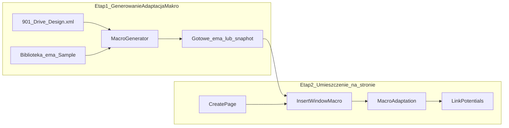

# SchemaGen — pipeline makr (2 etapy)

## Problem z obecnym podejściem

Makra w `Makra\Schemagen\` pochodzą z **EPLAN Sample Project** (=GAA, PlaceHoldery, tagi PLC).  
Przy wstawieniu do `Hello_world` (=SCHEMAGEN) bez adaptacji:

| Objaw | Przyczyna |
|-------|-----------|
| `=GAA-2L1` vs `2L1` — brak odnośników | różne nazwy potencjałów między makrami |
| `[20171<218<44025...]` zamiast tagów PLC | nierozwiązane PropertyPlacement / struktura =GAA |
| RY/RX pozycjonowanie | `Insert.WindowMacro` PointD: **X→RY, Y→RX** (nie intuicyjne) |

**Etap „wstaw na stronę” mamy opanowany** (`InsertPowerMacroAction`).  
Brakuje **etapu adaptacji / generacji** przed lub tuż po insert.

---

## Proponowany podział



### Etap 1 — Generowanie / przygotowanie makra

**Wejście:** XML konfiguracji + szablon `.ema` (lub netlista logiczna)  
**Wyjście:** makro gotowe do insert **w kontekście projektu docelowego**

Opcje implementacji (rosnąca złożoność):

| Wariant | Opis | Kiedy |
|---------|------|-------|
| **1A — Makra projektowe** | Jednorazowo zapisane `.ema` z poprawnymi nazwami (=SCHEMAGEN, 2L1) | Teraz — najszybsze |
| **1B — Adaptacja po insert** | `MacroAdaptation.cs` — remap struktury, potencjały, PlaceHolder | **Zaimplementowane w 1.5+** |
| **1C — Generator z XML** | `relay_latch.xml` / rozszerzony config → parametry makra | Faza 3–4 |
| **1D — Macro Builder** | Karta katalogowa → symbol + metadane + `.ema` | Faza 5+ |

Etap 1 **nie musi** tworzyć pliku `.ema` za każdym razem — wystarczy **snapshot logiczny** (lista funkcji, potencjałów, tagów PLC) + apply na stronie.

### Etap 2 — Umieszczenie na stronie (obecny)

Już działa:

- `SchemaGenCreatePage` — strona z opisem
- `SchemaGenInsertPowerMacro` — `Insert.WindowMacro` + `MacroAdaptation`
- `SchemaGenLinkPotentials` — normalizacja + `generate CONNECTIONS` + audyt

Stałe pozycji ([`SchemaGenPaths.cs`](../scripts/addin/SchemaGenPaths.cs)):

```
PointD(MacroInsertRy, MacroInsertRx)
  MacroInsertRy = 17.2  → oś RY (góra makra docelowo 0,6)
  MacroInsertRx = 8.35  → oś RX (przywrócone po błędnym 9,85)
```

Parametry CLI: `MACROX` = RY, `MACROY` = RX.

---

## Rekomendacja na najbliższe sesje

1. **Teraz (1.5+):** Etap 2 + `MacroAdaptation` po każdym insert — bez nowego generatora plików `.ema`
2. **Sesja 1.6:** tagi PLC / podmiana oznaczeń (`=MACHINE+CABINET-M1`) w `MacroAdaptation`
3. **Faza 3:** deklaratywny XML obwodów (`config/circuits/*.xml`) zamiast hardcoded ścieżek makr
4. **Faza 5+:** Macro Builder jako osobny produkt; SchemaGen konsumuje wygenerowaną bibliotekę

## Pliki

| Plik | Etap |
|------|------|
| [`MacroAdaptation.cs`](../scripts/addin/MacroAdaptation.cs) | 2 — adaptacja po insert |
| [`InsertPowerMacroAction.cs`](../scripts/addin/Actions/InsertPowerMacroAction.cs) | 2 — insert + adapt |
| [`LinkPotentialsAction.cs`](../scripts/addin/Actions/LinkPotentialsAction.cs) | 2 — potencjały między stronami |
| [`SchemaGenPaths.cs`](../scripts/addin/SchemaGenPaths.cs) | 2 — pozycja RY/RX |
