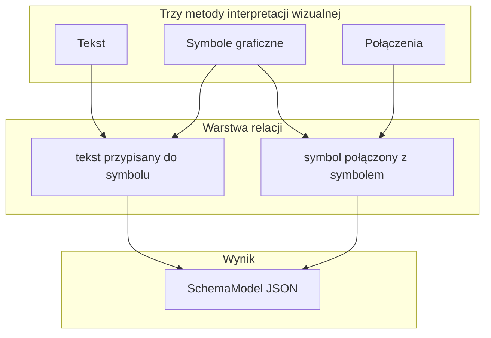

# Interpretacja schematu — trzy filary + relacje

**Data:** 2026-06-15  
**Decyzja Filipa:** rezygnacja z atlasu QET i kuratora na tym etapie. Ground truth ze **skanów schematów**, nie z bibliotek zewnętrznych.

---

## Cel systemu

Schemat to warstwa wizualna. System musi **osobno** odczytać trzy rodzaje informacji, potem **złożyć relacje**.

---

## Filar 1 — Symbole graficzne

**Co:** prostokąty wokół urządzeń / symboli IEC na rysunku.  
**Jak (runtime):** YOLO ONNX → `components[]` z `bbox`.  
**Jak (GT):** labeler — **najpierw bbox, potem hasło typu** (prompt 010).  
**Klasa YOLO (etap 1):** `element` — jedna klasa detekcji; typ w polu `tag` / później klasyfikacja.

| Pliki | Rola |
|-------|------|
| `labeler/` | bbox + hierarchia 003 |
| `train/`, `backend/recognize/symbol_detector.py` | trening + inferencja |
| `config/symbol-palette.yaml` | skrót przy oznaczaniu (hasła PL, **bez** atlasu QET) |

---

## Filar 2 — Tekst

**Co:** napisy na schemacie — tagi instancji (`-K1`, `-F3`), opisy, adresy krosowe, wartości.  
**Jak (runtime):** PaddleOCR offline → `annotations[]` / `Component.tag`.  
**Jak (GT):** bboxy tekstu w labelerze (model `TextAnnotation` w `backend/models/label.py` — UI do rozbudowy) lub korekta OCR.

| Prompt | Status |
|--------|--------|
| `002-ocr-engine.md` | OPEN — `PaddleOcrEngine` |

**Relacja (faza 2):** który tekst należy do którego symbolu — bliskość geometryczna, reguły IEC 81346-1, ewent. linia leader.

---

## Filar 3 — Połączenia

**Co:** linie przewodów, szyny, PE — **topologia elektryczna**.  
**Rozróżnienie:** `GraphicLine` (co widać) vs `Connection` (graf logiczny). Tylko `wire` / `bus` → kandydaci na `Connection`.

**Jak (runtime):** LineTracer + LineClassifier → `graphic_lines[]`; GraphBuilder → `connections[]`.  
**Jak (GT):** linie w labelerze (prompt `002-labeler-lines-colors.md`).

| Prompt | Status |
|--------|--------|
| `003-line-tracer-classifier.md` | OPEN |
| `002-labeler-lines-colors.md` | OPEN |
| `004-graph-builder.md` | OPEN — po 001–003 |

**Relacja (faza 2):** linia `wire`/`bus` łączy **terminal / brzeg symbolu** A z B — przecięcia z bbox, heurystyka kierunku.

---

## Warstwa relacji (po filarach)

| Relacja | Wejście | Wyjście |
|---------|--------|---------|
| Tekst → symbol | bbox tekstu + bbox symbolu + OCR | `Component.tag`, powiązania w schema |
| Symbol → symbol | linie wire/bus + bbox | `Connection` (`from`, `to`, `kind`) |
| Tekst → połączenie | opcjonalnie (potencjał, etykieta przewodu) | `Connection.potential` |

Implementacja docelowa: [`sync/prompts/004-graph-builder.md`](../sync/prompts/004-graph-builder.md) + reguły walidacji.

**Na tym etapie:** Filip buduje GT per filar (bboxy symboli, potem linie, potem tekst). Relacje — gdy każdy filar ma minimalne dane.

---

## Czego NIE robimy (etap 1)

| Temat | Status |
|-------|--------|
| Atlas QET (`008a`), kurator TAK/NIE, `data/atlas/qet/` | **Rezygnacja** — kod może zostać w repo, **nie używać w runtime ani labelerze** |
| `symbol-reference.yaml` jako picker | **Nie** — zastąpione `symbol-palette.yaml` (same hasła) |
| Cropy PNG z QET | **Nie** |
| Tagi proceduralne, charakterystyki urządzeń | Później |

---

## Kolejność prac (propozycja)

1. **010** — labeler symbole (bbox-first + paleta haseł) + duża baza bbox Filipa  
2. **002 OCR** — silnik tekstu (równolegle lub tuż po 010)  
3. **002 labeler linie** + **003 line tracer** — filar połączeń  
4. **004 graph builder** — składanie + relacje tekst↔symbol↔połączenie  
5. Re-train YOLO przy większej bazie; ewent. multi-class gdy starczy bboxów **ze skanu** per typ

---

## Zasada treningu

Detekcja symboli uczy się **wyłącznie ze skanów oznaczonych przez Filipa**. Żadne biblioteki CAD (QET, IEC PDF) nie są źródłem obrazów treningowych na tym etapie.
